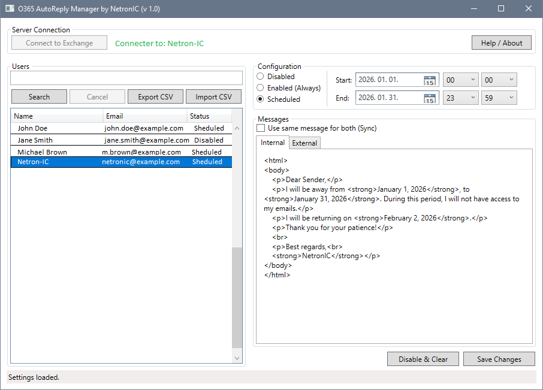

# O365-AutoReply-Manager (v1.0) by NetronIC
GUI tool for managing Exchange Online Out-of-Office settings

  

# O365 AutoReply Manager
A powerful, GUI-based PowerShell application for managing Microsoft 365 (Exchange Online) mailbox automatic replies (OOF). Handle individual or bulk updates with ease, featuring a built-in HTML editor and CSV import/export capabilities.
---
## 🇭🇺 Magyar Leírás
Ez az alkalmazás lehetővé teszi Microsoft 365 postaládák automatikus válaszainak egyszerű kezelését grafikus felületen keresztül.

### Fő funkciók:
- **Grafikus felület (GUI)**: Nincs szükség PowerShell parancsok ismeretére a napi használathoz.
- **HTML szerkesztő**: Formázott (félkövér, dőlt, listák, linkek) válaszüzenetek készítése.
- **Időzítés**: Pontos kezdő és záró dátum/időpont beállítása.
- **Tömeges műveletek**: Több felhasználó egyidejű kijelölése és módosítása.
- **CSV Import/Export**: Felhasználói beállítások mentése és betöltése fájlból.

### Rendszerkövetelmények:
- Windows 10/11 vagy Windows Server.
- PowerShell 5.1 vagy PowerShell 7+.
- ExchangeOnlineManagement modul (v3.0.0+).
- Megfelelő jogosultság (pl. Exchange Administrator).

* Hibajelentés vagy közreműködés esetén kérjük, olvassa el a belső dokumentációt, vagy vegye fel a kapcsolatot a fejlesztői csapattal. *
---
## 🇺🇸 English Description
This application allows for easy management of Microsoft 365 mailbox automatic replies through a professional graphical interface.

### Key Features:
- **Modern GUI**: Native Windows look and feel, no CLI knowledge required for end users.
- **Rich HTML Editor**: Create formatted internal and external messages with bold, italics, lists, and links.
- **Scheduling**: Granular control over start and end times.
- **Batch Processing**: Select multiple users to apply the same settings simultaneously.
- **CSV Data Management**: Export current status for reporting or import settings in bulk via CSV.

### Requirements:
- Windows 10/11 or Windows Server.
- PowerShell 5.1 or PowerShell 7+.
- ExchangeOnlineManagement module (v3.0.0 or later).
- Administrative permissions in Exchange Online.
---
## 🚀 Installation & Usage
1. **Requirements Check**: Ensure the `ExchangeOnlineManagement` module is installed. The app will prompt to install it if missing.
2. **Launch**: Run `O365Manager.exe` or execute `O365Manager.ps1` in PowerShell.
3. **Connect**: Click **"Connect to Exchange"** and sign in with your M365 admin credentials.
4. **Search**: Find users by name or email in the search bar.
5. **Configure**: Select one or more users, set the status (Enabled/Scheduled/Disabled), and compose your messages.
6. **Save**: Click **"Save Changes"** to apply the settings to the cloud.
   
## 📄 License & Attribution
- **Developer**: NetronIC
- **Version**: 1.0
- **Built with**: PowerShell, WPF/XAML, and Exchange Online REST API.
---
*For issues or contributions, please refer to the internal documentation or contact the development team.*
